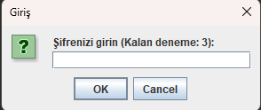
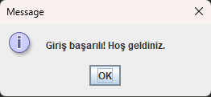
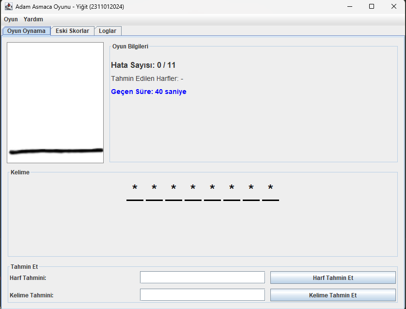
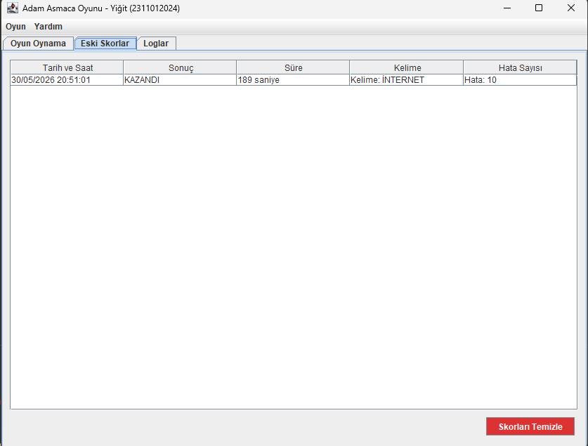
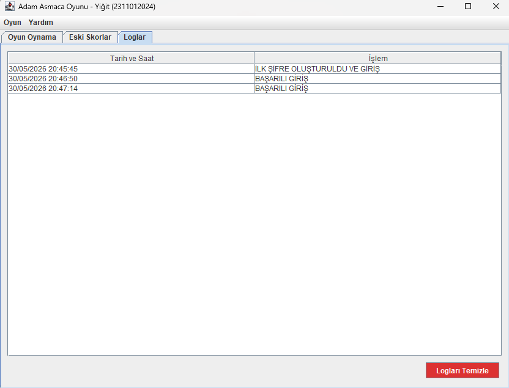

# 🎮 Java Swing - Adam Asmaca Oyunu (Hangman)

[](https://www.oracle.com/java/)
[](https://docs.oracle.com/javase/tutorial/uiswing/)
[](https://github.com/)

Bu proje, **Programlama II** dersi kapsamında **Dr. Turgay Aydoğan** adına geliştirilmiş, Java Swing kütüphanesi kullanılarak tasarlanmış masaüstü tabanlı bir **Adam Asmaca** oyunudur.

Gelişmiş kullanıcı arayüzü, dinamik sekme yenilemeleri, güvenli şifre doğrulama mekanizması ve dosya tabanlı loglama/skorlama sistemine sahiptir.

---

## 👤 Geliştirici Bilgileri
* **Adı Soyadı:** Yiğit
* **Öğrenci Numarası:** 2311012024
* **Ders:** Programlama II Dersi Ödevi
* **Ders Sorumlusu:** Dr. Turgay Aydoğan

---

## 🚀 Proje Özellikleri

### 1. Güvenli Giriş Sistemi (Şifre Doğrulama)
* Program ilk kez çalıştırıldığında kullanıcıdan bir yönetim şifresi belirlemesi istenir ve bu şifre `sifre.txt` dosyasına kaydedilir.
* Sonraki açılışlarda kullanıcıdan bu şifre talep edilir.
* **3 hatalı giriş denemesi** yapıldığında program güvenlik amacıyla kendini otomatik olarak sonlandırır.

### 2. Loglama Sistemi (`log.txt`)
* Şifre belirleme, başarılı girişler ve hatalı şifre denemeleri anlık tarih/saat damgası ile log dosyasına kaydedilir.
* Loglar arayüzdeki özel sekmeden anlık olarak takip edilebilir.

### 3. Oyun Mekanikleri & Görsel Süreç
* `kelimeler.txt` dosyasından rastgele seçilen **en az 6 harfli 30 farklı kelime** ile oynanır.
* Kullanıcının harf veya doğrudan kelime tahmini yapma seçeneği vardır.
* Toplam **11 hata hakkı** bulunur ve yapılan her hatada görsel adam asmaca süreci (`1.jpg`'den `11.jpg`'ye) dinamik olarak güncellenir.
* Süreölçer (Timer) ile oyun esnasında geçen süre anlık olarak saniye bazında gösterilir.

### 4. Skor Kayıt ve Takip Sistemi (`oyunlar.txt`)
* Tamamlanan her oyunun sonucu (Kazandı/Kaybetti), geçen süresi, tahmin edilen kelime ve hata sayısı skor tablosuna kaydedilir.

### 5. Dinamik Sekme Yapısı (`JTabbedPane`)
* Oyun üç sekmeden oluşur: **Oyun Oynama**, **Eski Skorlar** ve **Loglar**.
* Sekmeler arası geçiş yapıldığı an veriler arka plandaki metin dosyalarından otomatik olarak okunur ve tablolar **anlık olarak güncellenir**.

### 6. Güvenli Veri Temizleme
* Skor tablosu ve log geçmişi arayüzdeki butonlar aracılığıyla silinebilir. Bu işlem için kullanıcı şifresinin girilmesi istenir.

### 7. UTF-8 Dosya Standartı
* İşletim sistemi dillerinden bağımsız olarak, Türkçe karakterlerin (`İ, Ş, Ğ, Ç, Ö, Ü`) tablolarda ve dosyalarda hiçbir bozulma olmadan gösterilmesi için tüm girdi/çıktı işlemleri **UTF-8** kodlama standardı ile yapılmıştır.

---

## 📷 Ekran Görüntüleri

Projenin arayüz tasarımını ve çalışma mantığını aşağıdaki görsellerden inceleyebilirsiniz:

### 🔐 Güvenli Giriş Sistemi
| Şifre Girme Ekranı | Başarılı Giriş Bildirimi |
| :---: | :---: |
|  |  |

### 🎮 Oyun Arayüzü ve Sekmeler
| Oyun Oynama Sekmesi |
| :---: |
|  |

| Eski Skorlar Sekmesi | Sistem Logları Sekmesi |
| :---: | :---: |
|  |  |

> 💡 **Ekran Görüntülerini Ekleme Yönergesi:** Yukarıdaki görsellerin GitHub sayfanızda yüklenebilmesi için, projenizin ana dizininde `screenshots` adında bir klasör oluşturup aldığınız ekran görüntülerini sırasıyla `giris.png`, `giris2.png`, `oyun.png`, `skorlar.png` ve `loglar.png` olarak kaydetmeniz yeterlidir.

---

## 📁 Proje Dosya Yapısı

Hocanın ve projenin gereksinimleri doğrultusunda dosya yolları mutlak (absolute) olarak tanımlanmıştır. Projenin düzgün çalışması için `P2Oyun` klasörünün doğrudan `C:\` dizininde olması gerekmektedir:

```text
C:\P2Oyun\
│
├─── AdamAsmaca.java (Ana kaynak kod dosyası)
│
├─── Resimler\
│    ├─── 1.jpg
│    ├─── 2.jpg
│    │    ...
│    └─── 11.jpg
│
└─── TXTDosyalar\
     ├─── kelimeler.txt (En az 6 harfli 30 kelime)
     ├─── sifre.txt (Şifre kayıt dosyası)
     ├─── log.txt (Giriş logları kayıt dosyası)
     └─── oyunlar.txt (Oyun geçmişi kayıt dosyası)
```

---

## 🛠️ Kurulum ve Çalıştırma

### Gereksinimler
* **Java Development Kit (JDK 8 veya üzeri)** kurulu olmalıdır.

### Adımlar

1. Bu depodaki `P2Oyun` klasörünü bilgisayarınızın **`C:\`** diskine kopyalayın.
2. Komut satırını (Terminal / CMD) açın ve aşağıdaki komutları sırasıyla çalıştırın:

```bash
# Proje dizinine geçiş yapın
cd C:\P2Oyun

# UTF-8 uyumlu olarak kodu derleyin
javac -encoding UTF-8 AdamAsmaca.java

# Oyunu çalıştırın
java AdamAsmaca
```

---

## 🎓 Akademik Dürüstlik ve Lisans
Bu proje eğitim ve değerlendirme amacıyla geliştirilmiştir. Ödev teslim tarihinden sonra açık kaynak olarak paylaşılmıştır. Birebir kopyalanarak teslim edilmesi akademik kurallara aykırıdır.
